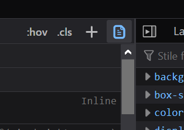

# Morris


> Make creating documents a pleasure.

[]()

Pandoc is an incredible powerful tool – which comes at the cost of being sometimes seemingly too complex.
This project aims to lower the hurdles and make document creating an easy thing. Morris provides you with everything you need to quickly generate beatiful documents from your Markdown.

Let's start! It's as easy as:

## Usage

```shell
make
```

Morris comes with a `makefile` you can modify to your liking.

- `make` will output a PDF for every `.md` file in the directory.
- `make both` will give you PDF & HTML.
- `make all` will output PDF, HTML, Word .docx, OpenOffice .odt, and InDesign .icml.
You can also be specific in what you generate by using the format as a make option, e.g. `make icml`.
- `make clean` will delete all generated content in the `OUTPUT_PATH` folder.


### Your Markdown
Be sure to include some [metadata](https://pandoc.org/MANUAL.html#variables) in your Markdown files:
Use a YAML block right at the file's beginning. Otherwise you can write in the same way you would always do.


### On PDFs
There are different ways to get a PDF from a Markdown document in Pandoc. The default action requires a LaTeX version to be installed. I'm not a big fan of this (using the Markdown/Pandoc combination was to avoid LaTeX in the first place).
Pandoc however supports a wide range of [other engines](https://pandoc.org/MANUAL.html#option--pdf-engine), mostly with HTML as an intermediate format. Something which appeals to me much more coming from the web.

Interesting are `wkhtmltopdf` and `weasyprint`. [Prince](https://www.princexml.com/) might be good, but it's proprietary and unaffordable if you aren't a multi-billion dollar company.  
[**Wkhtmltopdf**](https://wkhtmltopdf.org/) is the next option here:  
However, the default will output an unreadable, smashed pile of text. You need a lot of styling to get something halfway decent.
This leads to more problems down the road. Wkthml uses a neolithic version of WebKit which makes it hardly usable (printing is no concern to the WebKit devs). Also none of the newer CSS stuff we got to like in the near past is supported. This already starts with trivial things like CSS variables (aka _custom properties_).
Soon enough you will be ridden with lots of meaningless errors and _man_, inserting a pagination is an endeavour on loosing your mind. And don't spend your time thinking about [hyphenation](https://github.com/wkhtmltopdf/wkhtmltopdf/issues/1730).

Younger and maybe less atrocious is [**Weasyprint**](https://weasyprint.org/).  
_Caveat for Windows users_: Weasyprint has a horrible and ridiculous way of [installation](https://weasyprint.readthedocs.io/en/stable/install.html#windows) – you have to install the GTK3 runtime…
Hint for Miniconda/Anaconda users: Since weasyprint is Python based you might have to activate the right environment first (à la `activate <py3>`).  
Once you got through the painful installation weasyprint appears to be quite nice and much more usable than wkhtml. If you intend to use the `makefile` you don't need to care anyway, because you need GNU make for that – meaning you should use [Cygwin](https://www.cygwin.com/) or the [Windows Subsystem for Linux WSL](https://docs.microsoft.com/en-us/windows/wsl/install-win10) (Win10 only).

Weasyprint supports CSS' `@page` rules (designed for [paged media](https://www.quackit.com/css/at-rules/css_page_at-rule.cfm) so we can easily pass a custom CSS via the usual Pandoc CLI param:

```shell
pandoc input.md -o output.pdf --pdf-engine=weasyprint -c morris.css
```
<br>

However, in the end, the [sad state of automated layouting solutions](https://mb21.github.io/blog/2016/08/13/The-sad-state-of-automated-layouting-solutions) didn't got better in the last 10 years. Proper engine support is still lacking many features. So regarding your own CSS: better keep it simple. (Think of styling an email – both has some 90's vibe to it.)


## Caution
**Be sure** you have a recent pandoc version. The versions in the package managers are usually _heavily_ outdated. Also follow the complete [weasyprint installation](https://weasyprint.readthedocs.io/en/stable/install.html) process.

<sub>

I _have_ tried to use NMAKE in Windows [by using Qt's _Jom_, a drop-in replacement], but it is too limited. So don't waste time on that.

</sub>


## Trivia
This project was named in honor of [William Morris](https://en.wikipedia.org/wiki/William_Morris).

---

<details>
<summary>

## Testing Print Stylesheets

</summary>

Testing print stylesheets might seem like a boring task involving of actual printing the page, but there is some possibility of making your live a bit easier:

### Firefox
There is a dedicated button to switch into print view:



### Chrome
Open the devtools, click on the three dots icon, select "More Tools > Rendering". In this tab you can choose to "Emulate CSS media".

Please be aware that this will only help with changes to CSS layout, but not with fragmentation (=_laying out the individual pages_). You still need to make a PDF for checking that.

</details>
