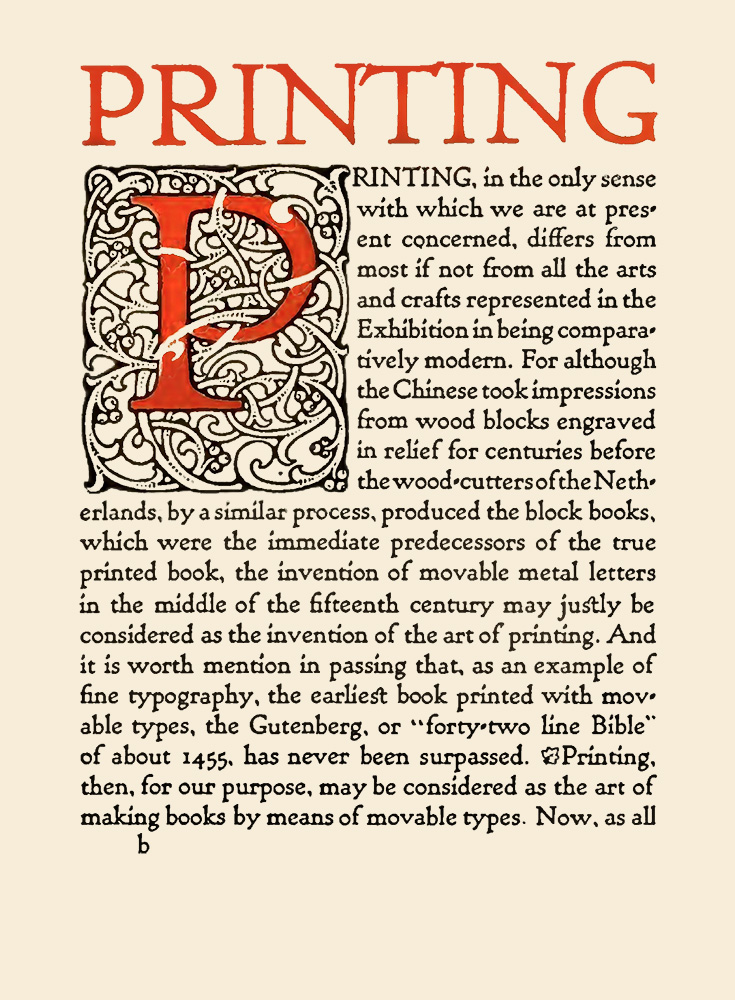

# Li nov lingua franca

> At solmen va esser necessi far uniform grammatica,
> pronunciation e plu sommun paroles.

Li **Europan lingues** es membres del sam familie ^[Inlines notes are easier to write, since you don't have to pick an identifier and move down to type the note.]. Lor separat _existentie es un myth_. Por scientie, musica, sport etc, litot Europa usa li sam vocabular. ~~Las longoes~~ Li lingues differe solmen in li grammatica^usus\ est^, li pronunciation ~(donostres)~ e li plu commun vocabules. Omnicos [directe al desirabilite](https://example.org) de un nov lingua franca: On refusa continuar payar [custosi traductores]{.smallcaps}. At solmen va esser necessi far uniform grammatica, pronunciation e plu sommun paroles. Ma quande lingues coalesce, li grammatica del resultant lingue es plu simplic e regulari quam ti del coalescent lingues [^1].

{.image-class height=200px}


## Omnicos directe 

- refusa continuar payar 
- custosi traductore
    + solmen va esser necessi
        * quande lingues coalesce
    + oalescent lingues
- simplic quam Occidental

1. solmen in li grammatica
    * custosi traductores
2. pronunciation e plu sommun
3. regulari quam li existent

Ma quande lingues coalesce, li grammatica del resultant lingue es plu simplic e regulari quam ti del coalescent lingues. Li nov lingua franca va esser plu simplic e regulari quam li existent Europan lingues. It va esser tam simplic quam Occidental in fact, it va esser Occidental. A un Angleso it va semblar un simplificat Angles, quam un skeptic Cambridge amico dit me que Occidental es. 


<blockquote cite="https://www.huxley.net/bnw/four.html">
<p>Words can be like X-rays, if you use them properly—they’ll go through anything. You read and you’re pierced.</p>
<footer>—Aldous Huxley, <cite>Brave New World</cite></footer>
</blockquote>

Li lingues differe solmen in li grammatica, li pronunciation e li plu commun vocabules.
A un Angleso it va semblar un simplificat Angles, quam alla <kbd>O</kbd> + <kbd>K</kbd> interuptus skeptic Cambridge amico dit me que Occidental es. Li Europan lingues es membres del sam familie. Lor separat existentie es un myth. Por scientie, musica, sport etc, litot Europa usa li sam vocabular. 

---------

Li Europan lingues es membres del sam familie. Lor separat existentie es un myth. Por scientie, musica, sport etc, litot Europa usa li sam vocabular. Li lingues differe solmen in li grammatica, li pronunciation e li plu commun vocabules. 

    At solmen va esser 
       necessi far uniform 
       g r a m m a t i c a,
    pronunciation e plu sommun paroles.

Omnicos directe al desirabilite de un nov lingua franca: On refusa continuar payar custosi traductores. At solmen va esser necessi far uniform grammatica, pronunciation e plu sommun paroles. Ma quande lingues coalesce, li grammatica del resultant lingue es plu simplic e regulari quam ti del coalescent lingues:

- [x] simplificat Angles
- [ ] Update the repo
- [ ] Panic!

A un `Angleso codex i amper et nosrum` it va semblar un simplificat Angles, quam un skeptic Cambridge amico dit me que Occidental es. Li Europan lingues es membres del sam familie. Lor separat existentie es un myth. Por scientie, musica, sport etc, litot Europa usa li sam vocabular.

```python
def MyFunc(var=False):
    # a comment
    if not var:
        var = True
    return
```

| Seperatis | Intexto        | Adrus |
| --------- | :------------: | ----: |
| familia   | semblar quo os |     1 |
| quom hep  | sedrum         |   nil |


Li lingues differe solmen in li grammatica, li pronunciation e li plu commun vocabules. Omnicos directe al desirabilite de un nov lingua franca: On refusa continuar payar custosi traductores. At solmen va esser necessi far uniform grammatica, pronunciation e plu sommun paroles.

Li nov lingua franca va esser plu simplic e regulari quam li existent Europan lingues. It va esser tam simplic quam Occidental in fact, it va esser Occidental. A un Angleso it va semblar un simplificat Angles, quam un skeptic Cambridge amico dit me que Occidental es. Li Europan lingues es membres del sam familie. Lor separat existentie es un myth. Por scientie, musica, sport etc, litot Europa usa li sam vocabular. Li lingues differe solmen in li grammatica, li pronunciation e li plu commun vocabules.


[^1]: Li nov lingua franca va esser plu simplic e regulari quam li existent Europan lingues. 